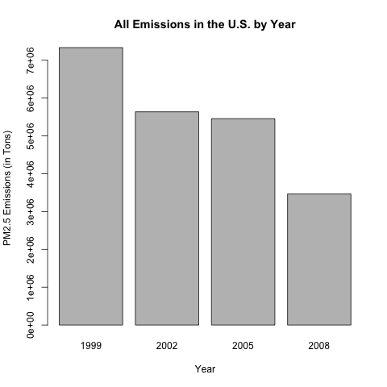
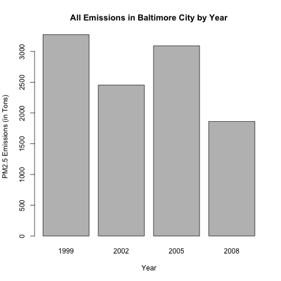
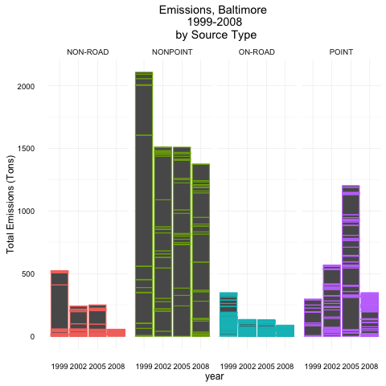
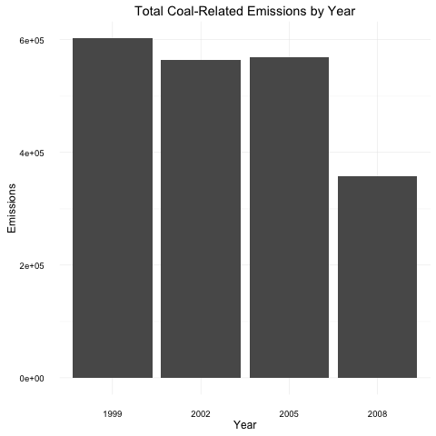
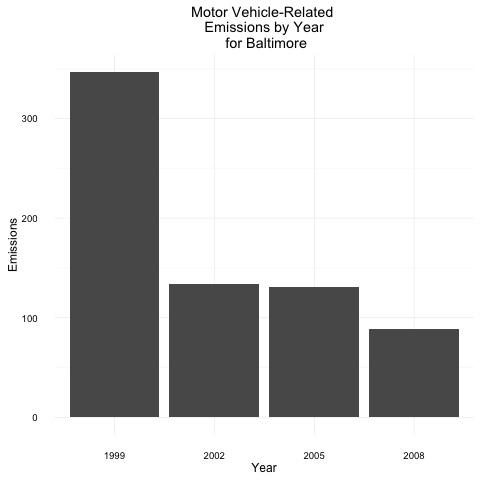
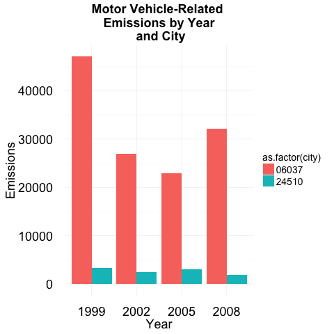

Exploratory Data Analysis - Course Project 2
============================================

**You'll find my answers below the instruction sheet, or click [here](##Questions)**

# Introduction

Fine particulate matter (PM2.5) is an ambient air pollutant for which there is strong evidence that it is harmful to human health. In the United States, the Environmental Protection Agency (EPA) is tasked with setting national ambient air quality standards for fine PM and for tracking the emissions of this pollutant into the atmosphere. Approximatly every 3 years, the EPA releases its database on emissions of PM2.5. This database is known as the National Emissions Inventory (NEI). You can read more information about the NEI at the EPA National [Emissions Inventory web site](http://www.epa.gov/ttn/chief/eiinformation.html).

For each year and for each type of PM source, the NEI records how many tons of PM2.5 were emitted from that source over the course of the entire year. The data that you will use for this assignment are for 1999, 2002, 2005, and 2008.

# Data

The data for this assignment are available from the course web site as a single zip file:

* [Data for Peer Assessment [29Mb]](https://d396qusza40orc.cloudfront.net/exdata%2Fdata%2FNEI_data.zip)

The zip file contains two files:

PM2.5 Emissions Data (`summarySCC_PM25.rds`): This file contains a data frame with all of the PM2.5 emissions data for 1999, 2002, 2005, and 2008. For each year, the table contains number of tons of PM2.5 emitted from a specific type of source for the entire year. Here are the first few rows.
````
##     fips      SCC Pollutant Emissions  type year
## 4  09001 10100401  PM25-PRI    15.714 POINT 1999
## 8  09001 10100404  PM25-PRI   234.178 POINT 1999
## 12 09001 10100501  PM25-PRI     0.128 POINT 1999
## 16 09001 10200401  PM25-PRI     2.036 POINT 1999
## 20 09001 10200504  PM25-PRI     0.388 POINT 1999
## 24 09001 10200602  PM25-PRI     1.490 POINT 1999
````

* `fips`: A five-digit number (represented as a string) indicating the U.S. county
* `SCC`: The name of the source as indicated by a digit string (see source code classification table)
* `Pollutant`: A string indicating the pollutant
* `Emissions`: Amount of PM2.5 emitted, in tons
* `type`: The type of source (point, non-point, on-road, or non-road)
* `year`: The year of emissions recorded

Source Classification Code Table (`Source_Classification_Code.rds`): This table provides a mapping from the SCC digit strings int he Emissions table to the actual name of the PM2.5 source. The sources are categorized in a few different ways from more general to more specific and you may choose to explore whatever categories you think are most useful. For example, source “10100101” is known as “Ext Comb /Electric Gen /Anthracite Coal /Pulverized Coal”.

You can read each of the two files using the `readRDS()` function in R. For example, reading in each file can be done with the following code:

````
## This first line will likely take a few seconds. Be patient!
NEI <- readRDS("summarySCC_PM25.rds")
SCC <- readRDS("Source_Classification_Code.rds")
````

as long as each of those files is in your current working directory (check by calling `dir()` and see if those files are in the listing).

# Assignment

The overall goal of this assignment is to explore the National Emissions Inventory database and see what it say about fine particulate matter pollution in the United states over the 10-year period 1999–2008. You may use any R package you want to support your analysis.

## Making and Submitting Plots

For each plot you should

* Construct the plot and save it to a PNG file.
* Create a separate R code file (plot1.R, plot2.R, etc.) that constructs the corresponding plot, i.e. code in plot1.R constructs the plot1.png plot. Your code file should include code for reading the data so that the plot can be fully reproduced. You should also include the code that creates the PNG file. Only include the code for a single plot (i.e. plot1.R should only include code for producing plot1.png)
* Upload the PNG file on the Assignment submission page
* Copy and paste the R code from the corresponding R file into the text box at the appropriate point in the peer assessment.

In preparation we first ensure the data sets archive is downloaded and extracted.


We now load the NEI and SCC data frames from the .rds files.


```r
NEI <- readRDS("summarySCC_PM25.rds")
SCC <- readRDS("Source_Classification_Code.rds")
```

## Questions

You must address the following questions and tasks in your exploratory analysis. For each question/task you will need to make a single plot. Unless specified, you can use any plotting system in R to make your plot.

### Question 1
**Have total emissions from PM2.5 decreased in the United States from 1999 to 2008? Using the base plotting system, make a plot showing the total PM2.5 emissions from all sources for each of the years 1999, 2002, 2005, and 2008.**

In order to handle the data, we'll get the sum of all emissions from their respective years,


```r
require(dplyr)
Totalem <- NEI %>%
select(Emissions, year) %>%
group_by(year) %>%
summarise(num.types = n(), emissions = sum(Emissions))
```
and then we'll plot them.

```r
barplot(
  (Totalem$emissions), names.arg=Totalem$year, xlab="Year", ylab="PM2.5 Emissions (in Tons)",
  main="All Emissions in the U.S. by Year")
```

 
Total emissions are showing a decrease over the years given.

### Question 2


**Have total emissions from PM2.5 decreased in the Baltimore City, Maryland (𝚏𝚒𝚙𝚜 == "𝟸𝟺𝟻𝟷𝟶") from 1999 to 2008? Use the base plotting system to make a plot answering this question.**


First we'll summarise emissions for Baltimore from 1999 to 2008,


```r
baltem <- NEI %>%
filter(fips=="24510")
select(Emissions, year) %>%
group_by(year) %>%
summarise(num.types = n(), emissions = sum(Emissions))
```
and then we'll plot them.

```r
barplot(
  (baltem$emissions), names.arg=baltem$year, xlab="Year", ylab="PM2.5 Emissions (in Tons)",
  main="All Emissions in Baltimore City by Year")
```
 


Emissions from PM2.5 have decreased in Baltimore City across the four years, but emissions spiked in 2005.

### Question 3

**Of the four types of sources indicated by the 𝚝𝚢𝚙𝚎 (point, nonpoint, onroad, nonroad) variable, which of these four sources have seen decreases in emissions from 1999–2008 for Baltimore City? Which have seen increases in emissions from 1999–2008? Use the ggplot2 plotting system to make a plot answer this question.**


```r
require(ggplot2)

p3 <- ggplot(baltem,aes(factor(year),Emissions,colour=factor(type))) +
  geom_bar(stat="identity") +
  theme_minimal() + guides(colour=FALSE)+
  facet_grid(.~type,scales = "free",space="free") + 
  xlab("year") + ylab("Total Emissions (Tons)") + 
  ggtitle("Emissions, Baltimore \n 1999-2008 \n by Source Type")

p3
```
 

The graph shows that the <b> Non-Road</b>, <b>Nonpoint</b>, and <b>On-Road</b> sources of emissions have all dropped over the course of the years provided.


**Which have seen increases in emissions from 1999–2008?**

The <b>point</b> emmissions source shows mostly an increase from 1999-2008. It increased until 2005 and saw a large decrease from 2005-2008.


### Question 4

**Across the United States, how have emissions from coal combustion-related sources changed from 1999–2008?**


First we get all coal-related emissions data,
```r
#Prepare data, get coal
coalist <- SCC[grepl("coal", SCC$Short.Name, ignore.case=TRUE),] #dataframe with coal-related emmissions
#merge the dataframes
mrg <- merge(NEI, coalist, by='SCC')
#Get the sum of emissions by year.
summed <- mrg %>%
  select(Emissions, year) %>%
  group_by(year) %>%
  summarise(num.types = n(), emissions = sum(Emissions))
```
and then we plot it.
```r
require(ggplot2)
#make ggplot
p4<- ggplot(data=summed, aes(as.factor(year), y=emissions)) + 
  geom_bar(stat="identity") + 
  ggtitle("Total Coal-Related Emissions by Year") + 
  ylab("Emissions") + theme_minimal() + guides(fill=FALSE) + xlab("Year")
p4
```

 

Coal emissions have decreased from 1999-2008.

### Question 5


**How have emissions from motor vehicle sources changed from 1999–2008 in Baltimore City?**

Get a subset of the data for motor vehicle emissions,
```r
#Prepare data, get motor vehicles for Baltimore
baltem <- NEI %>%
  filter(fips=="24510" & type == 'ON-ROAD') %>%
  select(Emissions, year) %>%
  group_by(year) %>%
  summarise(num.types = n(), emissions = sum(Emissions))
```
then we plot it.

```r
require(ggplot2)
p5<- ggplot(data=baltem, aes(as.factor(year), y=emissions)) + 
  geom_bar(stat="identity") + 
  ggtitle("Motor Vehicle-Related \n Emissions by Year \n for Baltimore") + 
  ylab("Emissions") + theme_minimal() + guides(fill=FALSE) + xlab("Year")
p5s
```

 

Motor Vehicle-Related Emissions for Baltimore have fallen from 1999-2008.


### Question 6

**Which city has seen greater changes over time in motor vehicle emissions?**


Compare cities with fips ID.
```r
#Prepare data, get motor vehicles for Baltimore
baltem <- NEI %>%
  filter(fips=="24510" | fips == '06037') %>%
  select(Emissions, year,"city" = fips) %>%
  group_by(year,city) %>%
  summarise(num.types = n(), emissions = sum(Emissions))
```

Now we plot using the ggplot2 system,


```r
p6<- ggplot(data=baltem, aes(as.factor(year), y=emissions, fill=as.factor(city))) + 
  geom_bar(stat="identity", position = "dodge") + 
  ggtitle("Motor Vehicle-Related \n Emissions by Year \n and City") + 
  ylab("Emissions") + theme_minimal() + xlab("Year") + my.axis.font
p6
```

 


Los Angeles County has the largest vehicle emissions changes over time.